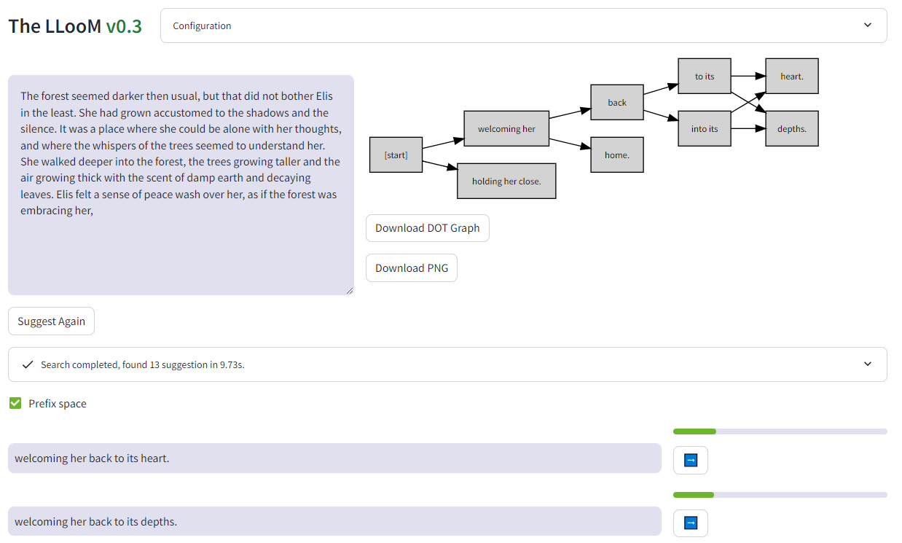
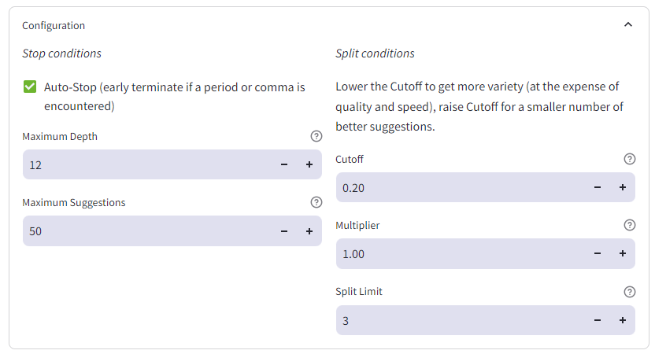

# The LLooM

Leverage raw LLM logits to weave the threads propability a few tokens at a time.

The problem with straight greedy decoding is that due to the self-recursive nature of LLMs, if there's a high-propability token hidden behind a low-probability one then greedy wont find it.

Conceptually this idea is similar to beamsearching, tracking multiple candidates at once, but with a human in the loop and unlimited beams.

# VisuaLL

Interactive multi-LLM logit mixing and debugging tool with multiple modes.

TODO: Screenshot here.

# News

*06/xx* Release **v1.0** with a new companion tool `VisuaLL` and support for TabbyAPI (exllamav2).  Note that configuration is now a .json file and not via enviroment variables, please review [Configuration File Syntax](CONFIG.md) when upgrading.

*06/02* Released **v0.3** with [vLLM](https://github.com/vllm-project/vllm) support and a quality of life improvement: if a suggestion beam starts with a stop token, it will be allowed to continue.

# User Guide

## LLooM

Give the LLooM a starting prompt, or change the Story any time by directly editing in the top input area and pressing Ctrl+Enter.

Click ➡️ beside a suggestion to accept it, or edit the suggestion (press Enter when done) in-line before accepting.

*Have fun!*

## VisuaLL

TODO

# Installation Guide

## Prepare python libraries

`pip3 install requests graphviz streamlit plotly pandas`

`sudo apt-get install -y graphviz`

## Launch API Server

See [Launching Local Servers](SERVERS.md)

## Create Configuration File

See [Configuration File Syntax](CONFIG.md)

## Enviroment variables

Configure number of parallel requests: `export LLAMA_PIPELINE_REQUESTS=2`

## Run Application

LLooM: `streamlit run loom.py <config.json>`

VisuaLL:  `streamlit run visuall.py <config.json>`

# LLooM Inference Configuration

You can open the Configuration dropdown at the top at any time to adjust parameters.

The parameters are grouped into two sections: when to stop, and when to split.

## Stop Conditions

`Auto-Stop` Early-terminate suggestion beams when a "." or "," character in encountered.

`Max Depth` The maximum number of tokens a suggestion beam can have. Note that if you disable the Auto-Stop condition, then all beams will have exactly this number of tokens.

`Maximum Suggestions` The maximum number of completed suggestion beams to return (this can be really useful to limit run-time if the model is slow).

## Split Conditions

`Cutoff` The minimum token propability (0.0 - 1.0) to spawn a new thread.

`Multiplier` cutoff per token slope (1.0: fixed cutoff, <1.0 cutoff decreases with depth, >1.0 cutoff increases with depth)

`Split Limit` the maximum number of times a suggestion beam can split (analogous to beamsearch with top-k)

# VisuaLL Inference Configuration

## Multi-LLM Modes

`Round Robin`: Models take turns generating text.

`Democratic`: Merge the logits from all models with every token, largest sum wins.

`Reference`: Always pick the output of the Reference model one but flag an error if any other model disagrees.  This is useful to compare quantized models vs FP16 or against each other.