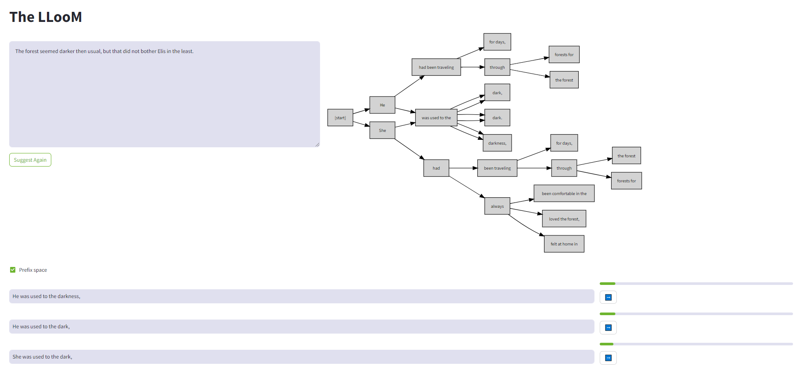

# The LLooM

Leverage raw LLM logits to weave the threads propability a few tokens at a time.

The problem with straight greedy decoding is that due to the self-recursive nature of LLMs, if there's a high-propability token hidden behind a low-probability one then greedy wont find it.

Conceptually this idea is similar to beamsearching, tracking multiple candidates at once, but with a human in the loop and unlimited beams.

# Screenshot



# Using

Give the LLooM a starting prompt, or change the Story any time by directly editing in the top input area and pressing Ctrl+Enter.

Click ➡️ beside a suggestion to accept it, or edit the suggestion (press Enter when done) in-line before accepting.

Have fun!

# Launching

## Prepare environment

`pip3 install requests graphviz streamlit`

`sudo apt-get install -y graphviz`

## Usage with llama.cpp

First, launch a llama.cpp server with a good Llama3-70B finetune:

```
./server -m ~/models/dolphin-2.9-llama3-70b.Q4_K_M.gguf -ngl 99 -sm row --host 0.0.0.0 -np 2 -c 8192 --log-format text
```

Note that you cannot use -fa as this results in all the logits being `null`.

Then launch the frontend with `LLAMA_API_URL` set to the host and port of the server:

```
LLAMA_API_URL=http://127.0.0.1:8080 streamlit run lloom.py
```

## Usage with OpenAI

Launch the frontend with `OPENAI_API_KEY`

```
OPENAI_API_KEY=sk-... streamlit run lloom.py
```

Model is currently hard-coded to `gpt-3.5-turbo`.

# Parameters

`Depth` How many tokens to generate per suggestion beam.

`Cutoff` The minimum token propability (0.0 - 1.0) to spawn a new thread.

`Multiplier` cutoff per token slope (1.0: fixed cutoff, <1.0 cutoff decreases with depth, >1.0 cutoff increases with depth)